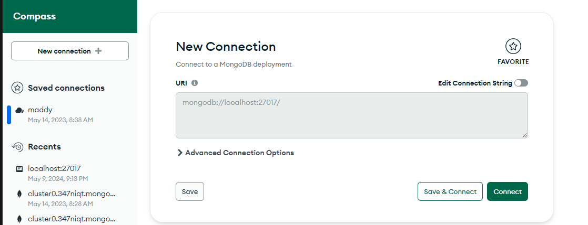

# Implement User Authentication and Logout

This repository contains a Authentication and Logout application built with React for the frontend, Express for the backend, and MongoDB for the database. Follow the instructions below to set up and run the application locally.

## Prerequisites
 Node.js and npm installed on your machine.
MongoDB installed and running locally.
MongoDB Compass installed on your machine.

## Installation
1) Clone the repository to your local machine:
git clone https://github.com/yourusername/your-repository.git

2) Navigate into the project directory:
cd your-repository

3) Install dependencies for both the frontend and backend:
npm install in both /client and /server directories
cd client
npm install

cd ../server
npm install

4) Set up your MongoDB database:
Make sure MongoDB is running on your local machine or provide the connection URI if it's hosted remotely.
Update the connection string in index.js if necessary.
and replace localhost with  ur localhost ip for ex 127.0.0.1:27017

mongoose.connect("mongodb://127.0.0.1:27017/school");

## Running the Application

1) Start the MongoDB server if it's not already running:

connect the server 

2) Start the backend server:
# Navigate to the backend directory
cd server
# Start the server
npm start

3) Start the frontend development server:
# Navigate to the frontend directory
cd client
# Start the development server
npm run dev

Open your web browser and visit (http://localhost:5173/) to view the application.

## Usage
Once the application is running, you can interact with it through the browser.
The frontend is accessible at http://localhost:5173/.
The backend API endpoints are accessible at http://localhost:3001.

## some Challenges face to login and refresh token 
facing challenges with implementing token-based authentication using JSON Web Tokens (JWTs), particularly with refreshing access tokens using refresh tokens. Let's address the issues :

**Login Endpoint with hashing**:  login endpoint (/login) seems to be handling user authentication correctly by generating both access and refresh tokens upon successful login.
**Refresh Token Functionality**:  implemented a renewToken function to handle token renewal using refresh tokens. However, it seems there might be some issues with how it's functioning, particularly with the logic for checking and verifying refresh tokens.
**Access Token Verification Middleware**: You've created a middleware function verifyUser to verify access tokens. This middleware should check the validity of the access token included in the request and proceed with the request if it's valid.
